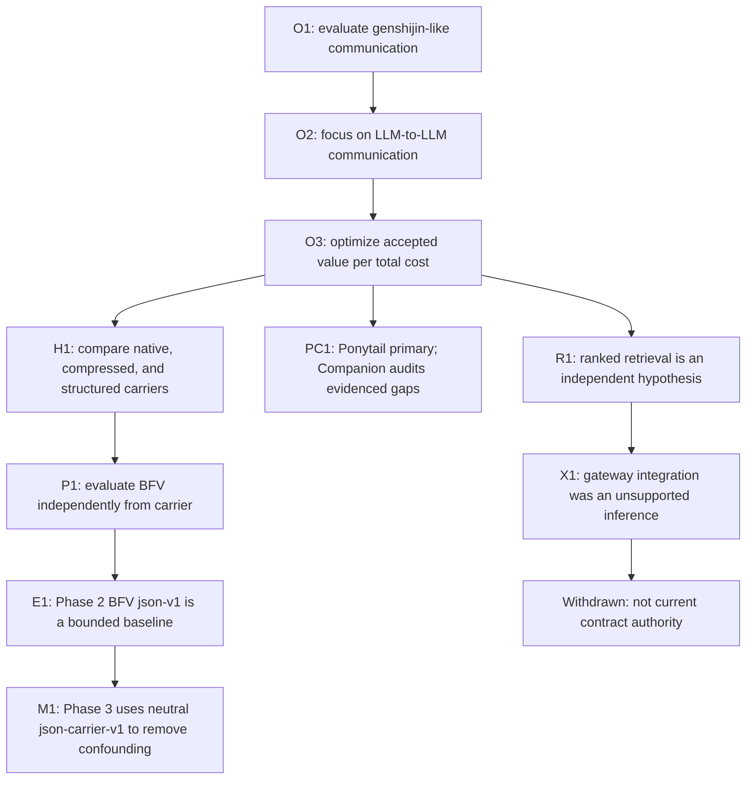

# Decision lineage

各ContractとAcceptance Criterionは、この系譜のどの項目から導かれたかを追跡できなければならない。

## Visual lineage

| ID | 状態 | Provenance | 内容 |
| --- | --- | --- | --- |
| O1 | active | USER_AUTHORIZED | `genshijin`型の簡略化・変換が現代LLMで効果を持つか評価する。 |
| O2 | active | USER_AUTHORIZED | 人間向け表示ではなく、LLM同士の通信を主対象として考える。 |
| O3 | active | USER_AUTHORIZED | token対performanceを総costで評価し、不要な人間介入を避ける。 |
| PC1 | active | USER_AUTHORIZED | [Issue #3](https://github.com/TakumiOkayasu/neologistic/issues/3)により、Ponytailをprimary workflow、user-facing interaction、実装最小化の主担当とし、`neologistic`はboundedなinterop / evaluation artifactとevidence-producing checkを担うCompanionとする。初期targetの判断は`no custom wire`。Ponytailの機能は再実装せず、補完は具体的な△ / ×が観測された領域に限る。既存のBFV package / artifactはhistorical evidenceとして、frozen Phase 3 harnessはexperimental assetとして保持し、変更・削除・成功結果への置換を行わない。 |
| H1 | hypothesis | ASSISTANT_INFERENCE | 独自delimiter、PUA、JSON等がnative communicationを上回る可能性がある。 |
| P1 | experimental | MIXED | BFVを、carrierとは独立したscope/verification/convergence policyとして評価する。 |
| T1 | active | USER_AUTHORIZED | ChatGPTとCodexを接続し、同一threadを継続できるtransportを用意する。 |
| E1 | bounded decision | EXTERNAL_EVIDENCE | Phase 2の限定条件ではBFV `json-v1`をoperational baseline、`pipe-v1`をchallengerとする。 |
| M1 | active method correction | ASSISTANT_INFERENCE + METHODOLOGY | BFV `json-v1`はpolicy意味論を含むため、Phase 3のcarrier比較ではneutralな`json-carrier-v1`を使用する。既存artifactは変更しない。 |
| R1 | independent hypothesis | EXTERNAL_EVIDENCE | 大規模・未限定corpusではglobal ranked retrievalが候補発見を改善し得る。 |
| X1 | withdrawn | ASSISTANT_INFERENCE | Retrieval gatewayを新規repositoryとして作りBridgeへ恒久統合する。人間承認とworkload-specific evidenceを欠いたため撤回。 |

## Contract admission rule

新しいContract要素は次のいずれかを満たす必要がある。

1. `USER_AUTHORIZED`な項目へ直接traceできる。
2. `EXTERNAL_EVIDENCE`または`ASSISTANT_INFERENCE`として明示され、read-onlyな検証だけを要求する。
3. 人間が新しい`USER_AUTHORIZED` decisionとして明示的にratifyする。

`ASSISTANT_INFERENCE`だけを根拠に、repository作成、複数repository変更、dependency/runtime、MCP/Plugin/Hook、release、architecture変更を実行してはならない。

Allowed side effectは個別の`source_intent_ids`を持ち、すべて`USER_AUTHORIZED`へtraceできなければならない。External evidenceやAssistant inferenceはauthorityを付与しない。

## Supersession rule

撤回済みの`X1`を、既存code、tag、README、commit、handoffが残っているという理由で再承認してはならない。

過去のartifactは事故・評価の証拠として保持できるが、現在のContract authorityにはしない。
