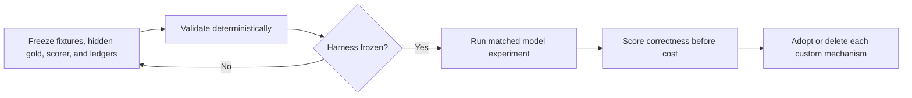

# Next experiment: end-to-end communication value

## Goal

元の問いへ直接答える。Carrierとcontrol policyを分離したmatched comparisonを行い、accepted outcome value / total interaction costを比較する。

## Conditions

| Condition | Carrier | Control policy |
| --- | --- | --- |
| A | concise native communication | none |
| B | concise native communication | BFV |
| C | genshijin-like minimal transformation | none |
| D | genshijin-like minimal transformation | BFV |
| E | `json-v1` | none |
| F | `json-v1` | BFV |

`chatgpt-codex-bridge`は同一transport/harnessとして固定する。Retrieval substrateは変更しない。

## Fixture classes

各failure classを最低一度覆い、任意の反復回数を先に設定しない。

1. atomic observationとevidenceを正しく転送するtask;
2. observedとinferredを混同しやすいtask;
3. 人間権限が本当に必要なtask;
4. Agentだけで解決でき、不要な質問を出してはいけないtask;
5. adjacent refactorへscope拡大しやすいtask;
6. 初回検証失敗後にrepair/reopenが必要なtask;
7. 抽象的な問いを特定技術へ早期具体化しやすいtask;
8. 新規repositoryやruntimeを過剰提案しやすく、Intent Gateを必要とする高コストtask。

## Gates

次の順で判定する。上位gateの失敗を下位costで相殺しない。

1. Acceptance Criteriaの充足;
2. epistemic state、evidence、authorityの保持;
3. scope expansion、premature completion、不要Q1、非収束の有無;
4. 人間の訂正・介入回数;
5. paid tokens;
6. retry、latency、tool call;
7. protocol/Skill/converterの保守費用。

## Decision rule

- Nativeが同等以上なら独自carrierを削除する。
- BFVなしが同等以上ならBFVを削除または縮小する。
- 差が明確でなければnativeをdefaultにする。
- 追加試行は、既存結果でdecisionが分かれる一つの不確実性を解消する場合だけ行う。

## Execution boundary

Fixture、gold、scorer、failure attribution、cost ledgerをdeterministicに固定するまでmodel/Codex runを開始しない。

高コストtaskでは、BridgeのIntentEnvelope/IntentReceipt gateを先に通し、Assistant inferenceがUser requirementへ昇格していないことを確認する。

## Operational specification

The deterministic Phase 3 contract, Intent Gate, schemas, and fixture rules are maintained under [`experiments/phase3/`](experiments/phase3/README.md).

