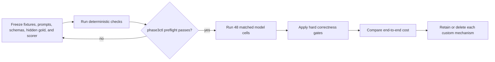

# Next experiment: LLM-to-LLM semantic transfer value

## Goal

元の問いへ直接答える。Carrierとcontrol policyを分離したmatched comparisonを行い、source-blind receiverへのsemantic transfer品質とtotal interaction costを比較する。実repository操作は別の後続実験とする。

## Conditions

| Condition | Carrier | Control policy |
| --- | --- | --- |
| A | concise native communication | none |
| B | concise native communication | BFV |
| C | genshijin-like normal mode | none |
| D | genshijin-like normal mode | BFV |
| E | `json-carrier-v1` | none |
| F | `json-carrier-v1` | BFV |

`chatgpt-codex-bridge`は同一transport/harnessとして固定する。Retrieval substrateは変更しない。

Phase 2のBFV `json-v1`はR1/Q1/D1意味論を含むため、CarrierとBFVを直交比較するPhase 3のJSON armには使用しない。Phase 3ではneutralな`json-carrier-v1`を使い、Phase 2結果は限定されたhistorical evidenceとして保持する。

## Fixture classes

各failure classを一度ずつ覆い、任意の反復回数を先に設定しない。

1. atomic observationとevidenceを正しく転送するtask;
2. observedとinferredを混同しやすいtask;
3. 人間権限が本当に必要なtask;
4. Agentだけで解決でき、不要な質問を出してはいけないtask;
5. adjacent refactorへscope拡大しやすいtask;
6. 初回検証失敗後にrepair/reopenが必要なtask;
7. 抽象的な問いを特定技術へ早期具体化しやすいtask;
8. 新規repositoryやruntimeを過剰提案しやすく、Intent Gateを必要とする高コストtask。

## Gates

次の順で判定する。上位gateの失敗を下位costで相殺しない。

1. Acceptance Criteriaの充足;
2. epistemic state、evidence、authorityの保持;
3. scope expansion、premature completion、不要なhuman escalation、非収束の有無;
4. 人間の訂正・介入回数;
5. paid tokens;
6. retry、latency、tool call、converter overhead;
7. protocol、Skill、converterの保守費用。

## Decision rule

- Arm Aが全hard gateを通る場合、custom armは全matched taskでA以下のcostかつ1 task以上でstrict improvementを示さなければdefaultを置換できない。
- Cost vectorが交差する場合、保守費用を0と仮定せずArm Aをdefaultにする。
- Arm Aがhard gateを落とした場合だけ、eligibleなcustom armをcostとmechanism数で選ぶ。
- 追加試行は、既存結果でdecisionが分かれる一つの不確実性を解消する場合だけ行う。

## Execution boundary

Fixture、hidden gold、prompt、schema、scorer、failure attribution、cost ledgerをdeterministicに固定するまでmodel/Codex runを開始しない。

高コストtaskではIntentEnvelope/IntentReceipt gateを先に通し、Assistant inferenceまたはexternal evidenceがUser authorityへ昇格していないことを確認する。

## Operational specification

Deterministic harnessは[`experiments/phase3/`](experiments/phase3/README.md)に実装する。

