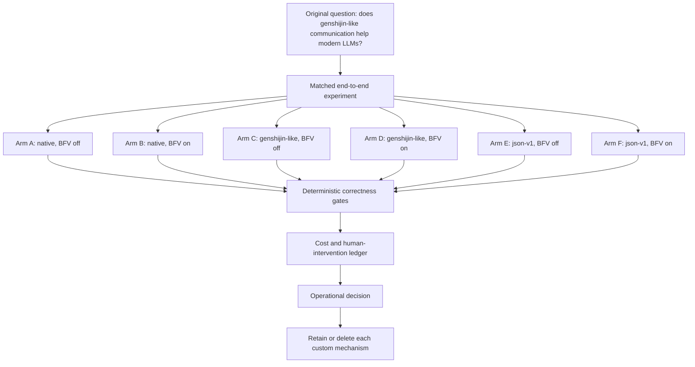

# Phase 3: End-to-End LLM Communication Value

This directory contains the operational specification for the next matched experiment. The repository-root `PROJECT_ORIGIN.md`, `DECISION_LINEAGE.md`, and `EXPERIMENT_PLAN.md` remain authoritative and are not duplicated here.

## Status

- Project reset: complete.
- Specification integration: complete after this change is committed.
- Deterministic fixtures, hidden gold, scorer, and cost ledger: not implemented yet.
- Paid model and Codex runs: prohibited until the deterministic harness is frozen.
- Retrieval: out of scope.

## Experiment structure

## Documents

- [Experiment specification](SPEC.md)
- [High-cost delegation intent gate](INTENT_GATE.md)
- [IntentEnvelope schema](schemas/intent-envelope.schema.json)
- [IntentReceipt schema](schemas/intent-receipt.schema.json)
- [Fixture design rules](fixtures/TASK_DESIGN_RULES.md)
- [Three-pass review](REVIEW.md)

## Next implementation boundary

Implement only deterministic fixtures, hidden gold, scorer, and ledgers. Do not invoke Codex or another paid model while those artifacts are still mutable.
