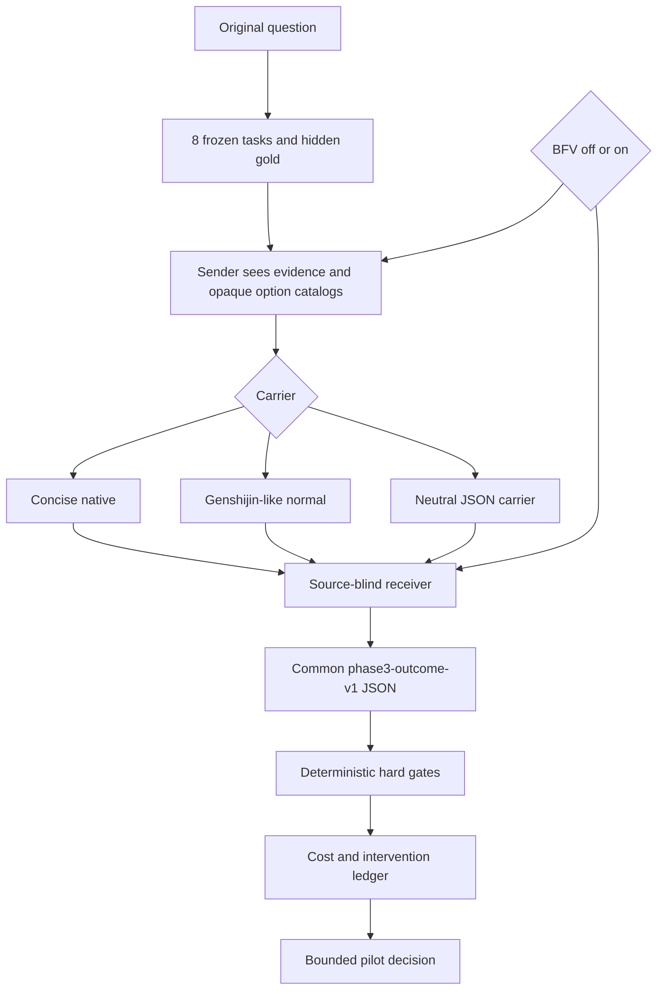

# Phase 3: LLM-to-LLM Semantic Transfer Pilot

Phase 3 returns to the original question: whether genshijin-like compression improves accepted LLM-to-LLM outcomes per total interaction cost. Carrier and BFV control policy are varied independently. Retrieval remains out of scope.

## Current boundary

This is a **semantic transfer pilot**, not a repository-editing benchmark. The sender derives a handoff from frozen evidence. A source-blind receiver converts that handoff into one common outcome schema. The deterministic oracle evaluates the resulting decision, epistemic state, evidence association, scope, authority, and readiness.



A later stateful execution experiment is justified only if this pilot shows that a custom mechanism survives semantic and cost gates.

## Status

- Project origin and decision lineage: fixed at repository root.
- Matched arms: 6.
- Failure-class fixtures: 8.
- Receiver source isolation and opaque public IDs: implemented.
- Intent Gate, strict renderer, scorer, cost ledger, early hard-failure elimination, and freeze manifest: implemented.
- Paid model or Codex calls: prohibited until `make check` and `make preflight` pass on the exact revision used by the runner.

## Commands

```sh
cd experiments/phase3
make check
```

Render prompts without invoking a model:

```sh
go run ./cmd/phase3ctl render -case p3-001 -arm A -stage sender

go run ./cmd/phase3ctl render \
  -case p3-001 \
  -arm A \
  -stage receiver \
  -handoff artifacts/example/handoff.txt
```

Create a frozen run manifest without invoking a model:

```sh
go run ./cmd/phase3ctl manifest \
  -run-id pilot-001 \
  -sender-provider <provider> \
  -sender-model <model> \
  -sender-effort <effort> \
  -receiver-provider <provider> \
  -receiver-model <model> \
  -receiver-effort <effort> \
  -transport <isolated-harness> \
  > artifacts/pilot-001/run-manifest.json
```

Score one completed cell before spending on the same arm again:

```sh
go run ./cmd/phase3ctl score-cell \
  -manifest artifacts/pilot-001/run-manifest.json \
  -observation artifacts/pilot-001/cells/p3-002/A/observation.json \
  -pricing artifacts/pilot-001/pricing.json
```

A `hard_failure: true` result eliminates that arm from later cells.

Score a completed run:

```sh
go run ./cmd/phase3ctl score \
  -manifest artifacts/pilot-001/run-manifest.json \
  -observations artifacts/pilot-001/observations.jsonl \
  -pricing artifacts/pilot-001/pricing.json \
  > artifacts/pilot-001/score.json
```

Bind and verify the completed artifact directory:

```sh
go run ./cmd/phase3ctl artifact-freeze \
  -directory artifacts/pilot-001

go run ./cmd/phase3ctl artifact-verify \
  -directory artifacts/pilot-001
```

All file arguments are repository-relative. Missing pricing or usage remains unavailable rather than becoming zero. Pricing uses `phase3-pricing-v2`, with exact entries for every sender and receiver provider/model pair.

## Documents

- [Experiment specification](SPEC.md)
- [Methodology](docs/METHODOLOGY.md)
- [Genshijin carrier provenance](docs/GENSHIJIN_PROVENANCE.md)
- [Runner and artifact contract](docs/RUNNER_CONTRACT.md)
- [Scoring](docs/SCORING.md)
- [Limitations and claim boundary](docs/LIMITATIONS.md)
- [High-cost delegation Intent Gate](INTENT_GATE.md)
- [Fixture design rules](fixtures/TASK_DESIGN_RULES.md)
- [Review record](REVIEW.md)
