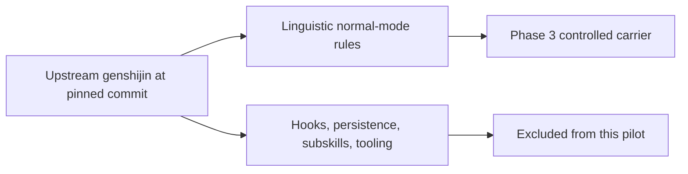

# Genshijin Carrier Provenance

## Pinned source

| Field | Value |
| --- | --- |
| Repository | `InterfaceX-co-jp/genshijin` |
| Commit | `968d3c449499fdefc00aff9f1fe9c52c4dfdc7ae` |
| Source path | `skills/genshijin/SKILL.md` |
| Git blob | `56bbc39e22da3d95e2b70fe22abfae715c67af8d` |
| Measured projection | normal-mode linguistic carrier only |

The frozen carrier prompt is [`../prompts/carriers/genshijin-normal.md`](../prompts/carriers/genshijin-normal.md). It is a controlled projection, not a claim that Phase 3 executes the full upstream plugin.

## Included behavior

The projection keeps the upstream normal-mode properties that directly affect sender-to-receiver text:

- remove politeness, cushioning, filler, redundant particles, formal nouns, auxiliary verbs, and repeated meaning;
- prefer compact clauses, noun endings, kanji compounds, and arrows for causal relations;
- preserve identifiers, code symbols, technical terms, numbers, units, errors, negatives, prohibitions, limits, exceptions, and order;
- fall back to ordinary Japanese for an ambiguity-sensitive fragment.

## Excluded behavior

Phase 3 does not measure:

- session hooks, mode persistence, status-line integration, or automatic reinforcement;
- commit, review, compression, statistics, crew, pack, or MCP-specific subskills;
- installation, security hardening, or multi-agent orchestration;
- the upstream repository's claimed percentage savings or technical-retention rate as established facts.

Those features add product and control-policy variables beyond the carrier axis. A full-plugin evaluation is a separate experiment and is justified only if the carrier projection survives the current semantic and cost gates.

