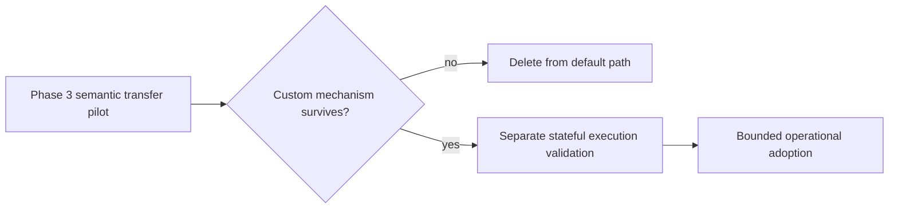

# Limitations and Claim Boundary

Phase 3 isolates semantic transfer. It deliberately does not test:

- repository inspection or editing;
- shell, filesystem, web, or MCP tool use;
- real repair execution after reopen;
- multi-turn human approval completion;
- long-horizon compaction or memory behavior;
- model reliability across repeated stochastic samples;
- all features of the upstream genshijin plugin.

The pilot can answer whether a carrier/policy preserves the selected decision semantics and consistently dominates the native baseline under the frozen transfer tasks. It cannot prove universal superiority or justify operational installation without a separate stateful validation.

A stateful follow-up must use disposable repositories, observable tool events, actual acceptance evidence, and its own frozen Contract. It must not be inferred automatically from a Phase 3 carrier win.
