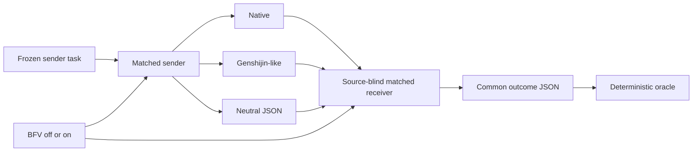

# Methodology

## Factor separation

The experiment is a 3 x 2 matched design: three carriers crossed with BFV off/on.

The common sender and receiver prompts define the minimum task interface and correctness vocabulary required by all arms. BFV adds only scope, necessity, verification, human-boundary, reopen, and convergence policy. The common safety floor is therefore not credited as a BFV effect.

## Sender and receiver isolation

The sender receives complete public evidence and option catalogs. The receiver receives no source content and no option text. It receives only opaque allowlisted IDs and the sender handoff. This prevents a receiver from solving the task independently of the measured communication.

For the Intent Gate fixture, the receiver also receives an immutable authority projection containing only human-authorized intent, Contract, allowed/forbidden side effects, and non-goals. Assistant inference and external evidence remain sender-side inputs and must be communicated through the handoff.

Fixture ID, class, title, and option identifiers are not semantic cues. IDs are frozen opaque sequences.

## Genshijin treatment

The carrier prompt is a controlled linguistic projection of upstream normal mode pinned to commit `968d3c449499fdefc00aff9f1fe9c52c4dfdc7ae`. It removes politeness, filler, redundant particles, formal nouns, and repetition while preserving identifiers, negatives, limits, exceptions, numbers, ordering, and ambiguity-sensitive fragments.

The full upstream plugin also contains hooks, persistence, subskills, stats, crew behavior, and control features. Those are excluded because Phase 3 measures carrier style, not the plugin as a product. The upstream claims of approximately 75% savings and complete technical retention are hypotheses, not accepted facts. The exact source identity and inclusion boundary are recorded in [Genshijin carrier provenance](GENSHIJIN_PROVENANCE.md).

## Neutral JSON carrier

The earlier Phase 2 BFV `json-v1` is not neutral: R1/Q1/D1 and its epistemic rules encode policy semantics. Phase 3 instead uses `json-carrier-v1`, which carries the same declared decision, assertion, action, concept, human-boundary, and IntentReceipt IDs available to prose carriers.

## Oracle design

The sender sees option text; the receiver sees only opaque IDs. Hidden gold maps those IDs to the expected decision, epistemic state, evidence, action set, human boundary, completion, concepts, and IntentReceipt. Surface punctuation and harmless wording are not scored as hard failures.

## Order, elimination, and retries

The run manifest uses a fixed high-signal fixture order and rotates arm order within fixtures. Automatic semantic retries are disabled. A completed hard failure eliminates only that arm from later fixtures. Runtime failures are recorded as observations and can also eliminate an arm. A fixture, scorer, or runtime defect may invalidate the run, but does not authorize silent response replacement.

## Claim boundary

One observation per fixture class provides controlled coverage, not a failure-rate estimate. Actual repository editing, tool use, repair execution, and long-horizon convergence require a separate stateful experiment after this pilot.
