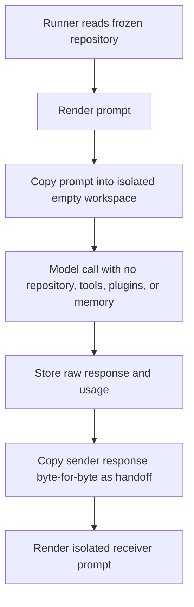
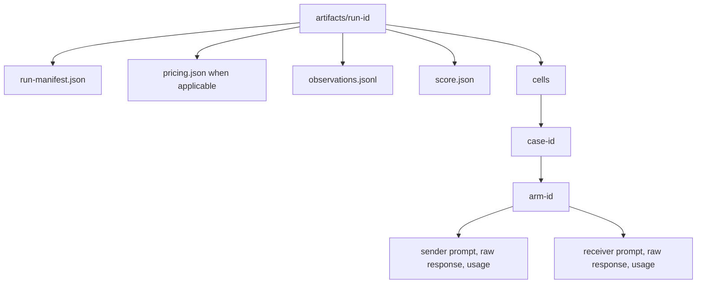

# Runner and Artifact Contract

## Preflight

Before any paid call:

```sh
cd experiments/phase3
make check
```

`phase3ctl preflight` must report `ready: true` and `model_calls: 0`. Any frozen-byte, file-mode, schema, fixture, prompt, or validator mismatch stops the run.

## Mandatory isolation

The model-visible environment must match the run manifest:

- workspace: empty temporary directory;
- repository access: disabled;
- filesystem and shell tools: disabled;
- MCP tools and plugins: disabled;
- project/user memory and rule injection: disabled;
- network: provider transport only;
- task input: exact rendered prompt only.

A Codex or agent harness may be used only when it can prove these conditions. Running from the `neologistic` checkout would expose hidden gold and invalidates the experiment.



## Run manifest

Create one manifest before calls begin. It binds:

- experiment scope;
- freeze-lock SHA-256;
- sender/receiver provider, model, and effort;
- transport identifier;
- isolation contract;
- fixed retry and early-elimination policy;
- exact 48-cell execution order.

The initial manifest includes all cells even though later cells may be skipped after a prior hard failure for the same arm.

If sender and receiver use different provider/model pairs, `pricing.json` must contain one exact entry for each. The scorer never applies one model's rates to another model's tokens.

## Execution policy

- Follow `execution_order` exactly.
- Use the same sender and receiver configuration for all arms.
- Make exactly one provider call for each sender and receiver stage; retries and tool calls are zero.
- Store exact rendered prompts and unmodified responses.
- Copy the sender response byte-for-byte into the receiver handoff.
- Do not normalize, trim, repair, or retry semantic failures.
- Record a runtime failure as an observation.
- After each cell, run `phase3ctl score-cell` against the single observation and inspect `hard_failure` before starting another cell for that arm.
- After the first hard failure for an arm, skip that arm's later cells.
- Continue unaffected arms.
- Record missing usage as unavailable, never zero.

## Artifact layout



After scoring and review artifacts are complete, run `phase3ctl artifact-freeze -directory <run-directory>` and then `phase3ctl artifact-verify -directory <run-directory>`. The generated `phase3-artifact-manifest-v1` binds content, file mode, and size for every regular file while rejecting symlinks. Defect attribution is appended separately and never replaces raw attempts; regenerating the artifact manifest after an authorized append is explicit and auditable.
